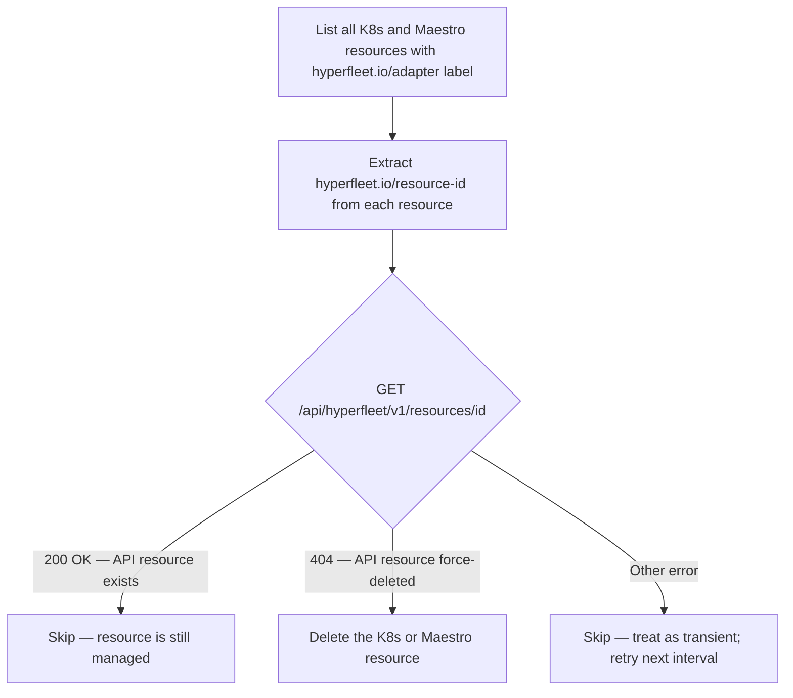

# Adapter Sweep Controller

> Part of [Adapter Resource Lifecycle Management Design](./adapter-lifecycle-management-design.md)

## What & Why

**What**: A background controller that periodically scans for K8s and Maestro resources carrying HyperFleet management labels whose corresponding HyperFleet API resource no longer exists, and deletes them.

**Why**: The normal reconciliation flow depends on the HyperFleet API sending a delete event to the adapter. A force-delete of the API resource bypasses that flow — the adapter never receives an event, so the managed K8s or Maestro resources are left running with HyperFleet labels but no live API counterpart. Without a sweep, these orphaned resources accumulate indefinitely.

The sweep controller cannot use the API as its source of truth: after a force-delete, the API has no record of the deleted resource. It must invert the question — instead of "what resources should exist?", it asks "does this resource that exists on the cluster still have a live API counterpart?"

## How

The sweep controller runs on a configurable interval and executes a three-step loop:

1. **Discover** — list all K8s resources and Maestro ManifestWork objects carrying the `hyperfleet.io/adapter` label, across all namespaces and resource kinds
2. **Verify** — for each discovered resource, extract `hyperfleet.io/resource-id` and call `GET /api/hyperfleet/v1/resources/{id}` on the HyperFleet API
3. **Act** — if the API returns 404, delete the K8s or Maestro resource; if the API returns the resource or any non-404 error, skip it

The generic `/resources` endpoint from [HYPERFLEET-896](https://issues.redhat.com/browse/HYPERFLEET-896) is the key enabler: the sweep controller works across all resource kinds without kind-specific logic.

### Prerequisites

| Prerequisite | Provided by |
|---|---|
| `hyperfleet.io/adapter` label on all managed resources | Automatic label stamping (`§2`) |
| `hyperfleet.io/resource-id` carrying the API UUID | Automatic label stamping (`§2`) |
| Labels stripped on intentional disownment | `lifecycle.detach.when` (`§1.4`) — detached resources are invisible to the sweep controller |
| Generic `/resources` endpoint | HYPERFLEET-896 — required for the verification call |

### Operational considerations

- **Interval**: configurable; a few hours is sufficient — force-deleted resources are not immediately harmful, just wasteful
- **Kubernetes CronJob**: The sweep controller is created as a kubernetes cron job periodically
- **Maestro**: ManifestWork objects carry the labels on the ManifestWork itself; the sweep controller deletes the ManifestWork, not the nested manifests
- **Dry-run mode**: should support a read-only mode that reports what would be deleted without acting
- **Per adapter**: we can have specific sweep jobs per adapter, in case more fine grained granularity is required for some type of resources

## Trade-offs

### What We Gain

- ✅ Orphaned resource cleanup without coupling to adapter availability — the sweep controller runs independently of adapter instances
- ✅ Works across all resource kinds via the generic `/resources` endpoint — no kind-specific logic required
- ✅ Intentional disownment (`lifecycle.detach.when`) is naturally invisible to the sweep: labels are stripped before the API resource is deleted, so the controller skips detached resources

### What We Lose / What Gets Harder

- ❌ Cleanup is eventual — orphaned resources linger for up to one sweep interval before being detected and removed
- ❌ Requires a separately deployed and operational component — if the sweep controller is down, orphaned resources accumulate silently
- ⚠️ Every managed resource requires two labels to be present — if label stamping (`§2`) is missing or stripped unexpectedly, resources become invisible to the sweep controller

### Acceptable Because

Force-deleted resources are wasteful but not immediately harmful. A bounded delay (configurable sweep interval, typically minutes) is an acceptable trade-off for decoupling cleanup from adapter and API availability. The alternative — synchronous cleanup via finalizers — creates a harder failure mode: a stuck finalizer blocks resource deletion indefinitely.

## Alternatives Considered

### K8s Finalizers

**What**: The framework adds a K8s finalizer to every managed resource at apply time. The finalizer is cleared only after the adapter confirms the HyperFleet API record is gone (via a pre-delete check). Cleanup is synchronous and guaranteed.

**Why Rejected**: Finalizers create an availability dependency — if the adapter is down or the HyperFleet API is unreachable, the managed resource is stuck in a terminating state indefinitely and cannot be cleaned up even manually without force-removing the finalizer. For infrastructure resources (Namespaces, ManifestWorks), a stuck finalizer is more harmful than a delayed sweep.

### Lease / Heartbeat Expiry

**What**: The adapter stamps a `hyperfleet.io/lease-expires-at` annotation (RFC3339, current time + lease duration) on every resource at apply time. An external controller deletes resources whose lease timestamp has passed.

**Why Rejected**: Requires a write on every successful apply — even for no-op drift-check events — to renew the lease. For adapters managing many resources at a high Sentinel cadence, this is significant write amplification. It also requires tuning the lease duration: too short and a temporarily unavailable adapter causes healthy resources to be deleted; too long and stale resources linger. The sweep controller achieves equivalent cleanup without per-event writes, at the cost of a sweep interval delay.

## Related Documentation

- [Adapter Resource Lifecycle Management Design](./adapter-lifecycle-management-design.md) — Main index document
- [Adapter Lifecycle Gates](./adapter-lifecycle-gates.md) — §1.4: `lifecycle.detach.when` — resources detached via this gate are invisible to the sweep controller
- [Adapter Label Stamping](./adapter-label-stamping.md) — §2: Automatic Label and Annotation Stamping — prerequisite for sweep controller discovery
- [Adapter Resilience Model](./adapter-resilience-model.md) — §3: Resilience Model
- [Adapter Stuck Detection](./adapter-stuck-detection.md) — §4: Stuck Detection
- [Adapter Periodic Execution](./adapter-periodic-execution.md) — §5: Periodic Execution
- [Adapter Resource Retention](./adapter-resource-retention.md) — §6: Resource Retention
