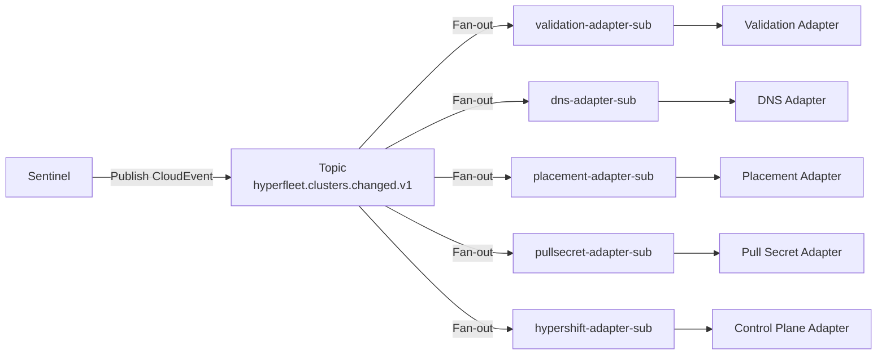
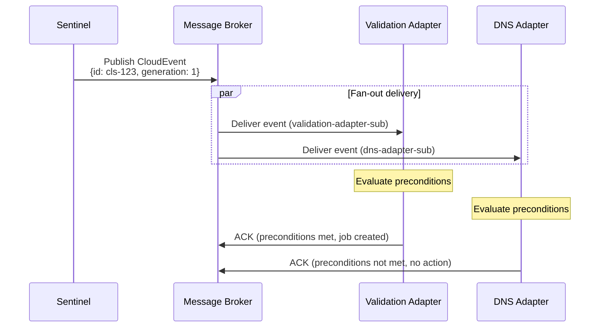

# HyperFleet Message Broker

**Status**: Active
**Owner**: HyperFleet Architecture Team
**Last Updated**: 2026-03-25

> The HyperFleet Message Broker is the fan-out layer that decouples the Sentinel reconciliation service from the Adapter Deployments. Sentinel publishes a single CloudEvent per resource reconciliation cycle; the Broker delivers that event to every registered adapter subscription simultaneously, enabling independent parallel execution of provisioning tasks without Sentinel or adapters knowing about each other.

---

## What & Why

**What**: A message broker implementing the fan-out (publish/subscribe) pattern to distribute CloudEvent reconciliation events from the Sentinel service to multiple Adapter Deployments. The broker is accessed via a pluggable abstraction that supports GCP Pub/Sub, RabbitMQ, and an in-memory Stub for local development.

**Why**:

Without a broker, Sentinel would need to know about every adapter and call each one directly. This creates tight coupling: adding a new adapter requires changing Sentinel, and a slow adapter blocks others. The broker solves this by:

- **Decoupling**: Sentinel publishes to a single topic without knowing which adapters exist. Adapters subscribe without knowing about Sentinel or other adapters.
- **Fan-out**: One reconciliation event automatically triggers all registered adapters in parallel.
- **Independent scaling**: Each adapter subscription is consumed independently — a high-volume adapter doesn't affect others.
- **Reliability**: At-least-once delivery guarantees ensure events are not lost if an adapter is temporarily unavailable.
- **Extensibility**: New adapters are added by creating a new subscription — no code changes to Sentinel or existing adapters.

---

## How

### Topic and Subscription Model



Each adapter gets its own subscription to the shared topic, so every adapter receives every event independently. Adapters evaluate their own preconditions to decide whether to act on an event.

### CloudEvent Format

All events conform to the [CloudEvents 1.0](https://cloudevents.io/) specification:

```json
{
  "specversion": "1.0",
  "type": "com.redhat.hyperfleet.cluster.reconcile.v1",
  "source": "sentinel-operator/cluster-sentinel-us-east",
  "id": "evt-abc-123",
  "time": "2025-10-21T14:30:00Z",
  "datacontenttype": "application/json",
  "data": {
    "kind": "Cluster",
    "id": "cls-abc-123",
    "href": "/clusters/cls-abc-123",
    "generation": 1
  }
}
```

The event payload is intentionally minimal (anemic event pattern — see [Design Decisions](#design-decisions)). Adapters fetch full resource details from the API after receiving the event.

### Supported Broker Implementations

| Implementation | Environment | Notes |
|----------------|-------------|-------|
| GCP Pub/Sub | Production | Cloud-native, highly available, at-least-once delivery |
| RabbitMQ | On-premise / self-hosted | AMQP-based, suitable for environments without GCP access |
| Stub (in-memory) | Local development / testing | No external dependencies, useful for adapter unit tests |

The broker implementation is selected via `BROKER_TYPE` environment variable. Sentinel and Adapters use separate broker ConfigMaps (Sentinel uses a publish config; Adapters use a subscribe config).

### Sentinel Broker Configuration

```yaml
# sentinel-broker-config.yaml (Sentinel publishes events)
apiVersion: v1
kind: ConfigMap
metadata:
  name: hyperfleet-sentinel-broker
data:
  BROKER_TYPE: "pubsub"            # or "rabbitmq", "stub"
  BROKER_PROJECT_ID: "hyperfleet-prod"  # GCP Pub/Sub only
  BROKER_TOPIC: "hyperfleet.clusters.changed.v1"
```

### Adapter Broker Configuration

```yaml
# adapter-broker-config.yaml (Adapters subscribe to events)
apiVersion: v1
kind: ConfigMap
metadata:
  name: hyperfleet-adapter-broker
data:
  BROKER_TYPE: "pubsub"
  BROKER_PROJECT_ID: "hyperfleet-prod"
  BROKER_SUBSCRIPTION_ID: "validation-adapter-sub"
```

### Event Flow



---

## Design Decisions

### Anemic Events (Minimal Payload)

**Decision**: Events contain only the resource ID, kind, href, and generation — not the full resource spec.

**Rationale**: Adapters always need fresh resource data when they act, so including full spec in the event creates a race condition (the spec may have changed between when the event was published and when the adapter processes it). The minimal event forces adapters to fetch current state from the API, ensuring they always act on authoritative data.

**Trade-off**: Adds one extra API call per adapter per event. Acceptable given that provisioning operations themselves take seconds to minutes.

### Fan-out via Subscriptions (Not Routing Keys)

**Decision**: All adapters receive all events via independent subscriptions to a single topic. Adapters evaluate their own preconditions to decide whether to act.

**Rationale**: Routing events to specific adapters at the broker level would require the broker or Sentinel to know which adapters exist and what they respond to. Adapter-side precondition evaluation keeps adapter logic self-contained and makes it trivial to add or remove adapters without touching the broker or Sentinel.

### Pluggable Broker Abstraction

**Decision**: The broker is accessed through a common Go interface (`BrokerPublisher` / `BrokerSubscriber`) with concrete implementations for each backend.

**Rationale**: HyperFleet must support GCP-managed environments (Pub/Sub) and on-premise environments (RabbitMQ). A shared interface allows Sentinel and Adapter code to be tested with the Stub implementation and deployed with whichever real broker the environment requires.

---

## Trade-offs

### What We Gain

- ✅ **Decoupling**: Sentinel and Adapters have zero direct knowledge of each other
- ✅ **Extensibility**: New adapters are added with zero changes to Sentinel or existing adapters
- ✅ **Parallel execution**: All adapters receive events simultaneously and run in parallel
- ✅ **Independent scaling**: Each adapter subscription scales independently
- ✅ **At-least-once delivery**: Broker guarantees events are not permanently lost
- ✅ **Pluggability**: Same codebase works with GCP Pub/Sub, RabbitMQ, or Stub

### What We Lose / What Gets Harder

- ❌ **Exactly-once semantics**: At-least-once delivery means adapters can receive duplicate events. Adapters must be idempotent.
- ❌ **Ordering guarantees**: Events may be delivered out of order within a subscription. Adapters must tolerate out-of-order delivery.
- ⚠️ **Operational overhead**: Running a message broker is an additional infrastructure component to deploy, monitor, and maintain.
- ⚠️ **Debug complexity**: Tracing an event from Sentinel through the broker to each adapter requires distributed tracing tooling.

### Technical Debt Incurred

- **No dead-letter queue (DLQ) policy defined**: If an adapter consistently fails to process an event, it may be retried indefinitely. A DLQ with alert on accumulation should be defined post-MVP.
  - **Impact**: Low (adapters are designed to be idempotent; retries are expected)
  - **Remediation**: Define DLQ configuration and alerting threshold in broker setup

### Acceptable Because

- At-least-once delivery is sufficient: all adapters are designed to be idempotent (they evaluate preconditions and report current state on every invocation)
- Eventual consistency (5–10 second Sentinel poll interval) is acceptable for cluster provisioning workflows
- Operational overhead is justified by the decoupling and extensibility benefits

---

## Alternatives Considered

### Direct Sentinel-to-Adapter RPC (HTTP/gRPC)

**What**: Sentinel calls each adapter's HTTP or gRPC endpoint directly when reconciliation is needed.

**Why Rejected**:
- Requires Sentinel to maintain a registry of all adapter endpoints — tight coupling
- Adding a new adapter requires a Sentinel configuration change and redeployment
- A slow or failing adapter blocks Sentinel from notifying other adapters
- No built-in retry or delivery guarantees

### Shared Database Polling (Outbox Pattern)

**What**: Sentinel writes reconciliation events to an "outbox" table; adapters poll the database for new rows.

**Why Rejected**: This was the v1 architecture. It was replaced in v2 specifically because:
- Requires an additional Outbox Reconciler component
- Higher latency (polling delay vs. direct publish)
- More complex API (transactional outbox writes alongside CRUD)
- Database becomes a bottleneck at scale

See `hyperfleet/architecture/architecture-summary.md` for the full v1 vs. v2 comparison.

### Single Event Queue (One Subscription for All Adapters)

**What**: All adapters share a single subscription queue; events are consumed by whichever adapter picks them up first (competing consumers).

**Why Rejected**: Competing consumers don't implement fan-out — each event would be processed by only one adapter. The HyperFleet model requires every adapter to evaluate every reconciliation event.

---

## Dependencies

| Dependency | Purpose |
|-----------|---------|
| GCP Pub/Sub (production) | Managed message broker in GCP environments |
| RabbitMQ (on-premise) | Self-hosted broker for non-GCP environments |
| Sentinel | Publishes reconciliation events to the broker topic |
| Adapter Framework | Consumes events from adapter-specific subscriptions |

---

## Interfaces

### Publisher Interface (used by Sentinel)

```go
type BrokerPublisher interface {
    Publish(ctx context.Context, event cloudevents.Event) error
    Close() error
}
```

### Subscriber Interface (used by Adapters)

```go
type BrokerSubscriber interface {
    Subscribe(ctx context.Context, handler func(event cloudevents.Event) error) error
    Close() error
}
```

---

## Related Documents

- [Architecture Summary](../../architecture/architecture-summary.md) — system-level view of broker's role
- [Sentinel Design](../sentinel/sentinel.md) — how Sentinel publishes events
- [Adapter Framework Design](../adapter/framework/adapter-frame-design.md) — how adapters subscribe and process events
- [Adapter Design Decisions](../adapter/framework/adapter-design-decisions.md) — anemic event pattern rationale
