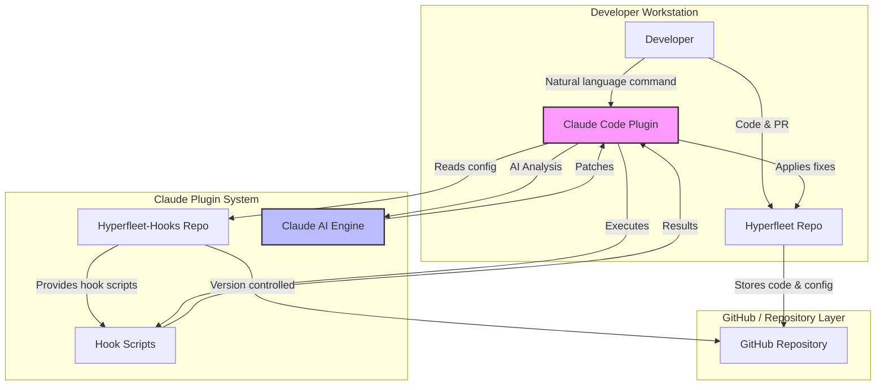
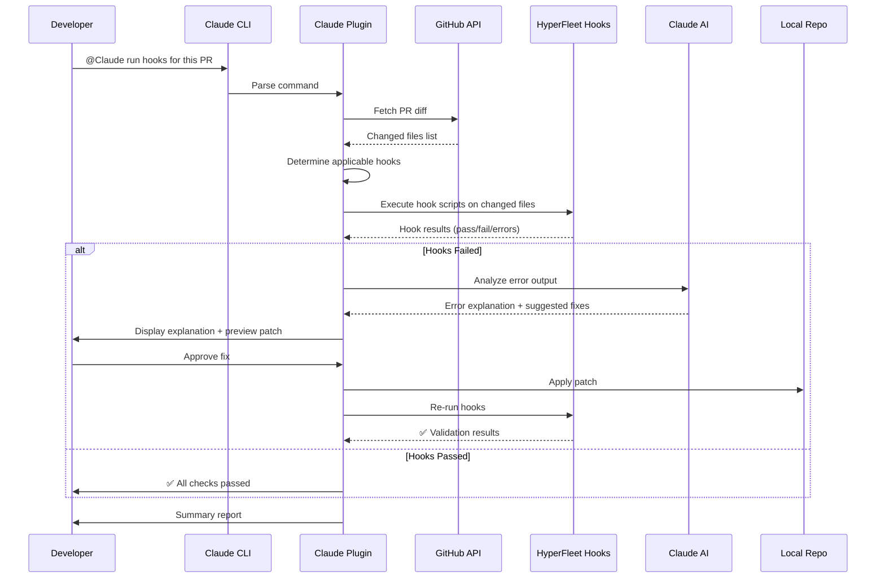

# Claude Code Plugin + HyperFleet Pre-commit Integration

**Status**: Draft
**Date**: 2025-11-24
**Version**: 1.0
**Owner**: HyperFleet Team

---

## Table of Contents

1. [Problem Statement](#1-problem-statement)
2. [Solution Overview](#2-solution-overview)
3. [Architecture](#3-architecture)
4. [Execution Flow](#4-execution-flow)
5. [Design Principles](#5-design-principles)
6. [Implementation Plan](#6-implementation-plan)
7. [Usage Examples](#7-usage-examples)
8. [Risks and Mitigations](#8-risks-and-mitigations)
9. [Appendices](#9-appendices)

---

## 1. Problem Statement

The team plan to reply on `pre-commit` (with shared configuration provided by `hyperfleet-hooks`) to enforce code quality and consistency. However, several practical issues have emerged:

### 1.1 Current Challenges

**High local installation/maintenance cost**
- Developers must install pre-commit, pip, and additional dependencies
- Installation issues lead to repeated debugging per person
- Version mismatches across developer environments

**Developers unsure how to run specific hooks**

Running the correct hook requires prior knowledge, increasing adoption friction:

```sh
# Which command should I use?
pre-commit run go-lint
pre-commit run json-validate
pre-commit run --files <list>
```

**Error messages hard to read and fix**

Pre-commit output is:
- Hard to understand
- Not user-friendly
- Often requires searching or AI assistance to fix
- Leads developers to eventually ask: "Claude, can you fix this for me?"

**Inconsistent fixes across team**
- Some apply minimal fixes
- Others reformat everything
- Some leave inconsistencies
- Results in uneven code quality

---

## 2. Solution Overview

### 2.1 Goals

Using the **Claude Code Plugin**, we aim to achieve:

**✅ No need to install pre-commit locally**

The plugin provides its own execution environment and executes the logic directly from `hyperfleet-hooks`.

**✅ Trigger hooks through natural language**

Examples:
```sh
@Claude run hooks for this PR
@Claude run openapi-check on changed files
@Claude run formatting hooks
```

**✅ Automatically fix errors**

Claude will:
1. Parse hook output
2. Explain the issue in plain language
3. Generate and apply patches
4. Re-run the hook to confirm correctness

**✅ Standardized fixes across the team**

One centralized logic produces consistent quality.

### 2.2 Feature Summary

| Feature | Supported | Notes |
|---------|-----------|-------|
| Auto-detect PR diff | ✅ | Natural language driven |
| Execute hyperfleet-hooks | ✅ | No pre-commit installation required |
| Explain hook output | ✅ | Clear, human-readable summaries |
| Auto repair | ✅ | AI-generated patches |
| Re-run hooks | ✅ | Verification after fixes |
| Full repo scan | ✅ | Opt-in when needed (not default) |

### 2.3 Value Proposition

Transform pre-commit from:

❌ **Painful local installation + hard-to-read errors + manual fixes**

into:

✅ **Natural language driven + auto-running hooks + auto-fix + unified quality**

This is not a simple wrapper around pre-commit, but an **intelligent, centralized quality enforcement workflow** that significantly improves developer experience and consistency.

---

## 3. Architecture

### 3.1 System Components



### 3.2 Component Relationships

- **hyperfleet-hooks**: Centralized hook implementations (shell scripts, configs)
- **Claude Code Plugin**: Execution layer + orchestration + AI reasoning
- **Claude AI Engine**: Error analysis + patch generation
- **GitHub API**: PR diff fetching + code storage  

---

## 4. Execution Flow

### 4.1 Sequence Diagram



### 4.2 Step-by-Step Execution

**Step 1: Developer triggers via natural language**

```sh
@Claude run hooks for this PR
```

**Step 2: Plugin fetches PR diff**

Using Claude CLI or GitHub API to determine changed files.

**Step 3: Determine which hooks apply**

File type to hook mapping:
- `.go` → gofmt, golangci-lint
- `.json` → JSON schema validation
- `.yaml` → Kubernetes YAML checks
- openapi files → openapi schema validation

**Step 4: Execute `hyperfleet-hooks` scripts directly**

**Important**: The plugin invokes hook scripts directly, **NOT** through `pre-commit`.

```sh
# Example execution
./hyperfleet-hooks/scripts/go-lint.sh file1.go file2.go
./hyperfleet-hooks/scripts/openapi-validate.sh api.yaml
```

**Step 5: Claude analyzes hook output**

The AI engine will:
1. Parse error messages and extract key information
2. Explain errors in natural language
3. Suggest specific solutions
4. Generate patches/diffs

**Step 6: Auto-fix with approval**

Claude proposes patches and applies them to the working directory after developer approval.

**Step 7: Re-run hooks for verification**

Ensures no regressions after applying fixes.

---

## 5. Design Principles

### 5.1 Changed Files Only (Default Behavior)

**Avoid running `pre-commit run --all-files`** unless explicitly requested.

**Reasons**:
- Hooks should operate on changed files, not the entire repo
- Full scans are slow and unnecessary for PR workflows
- May produce irrelevant failures and degrade UX
- Scales poorly as repo grows

**Solution**: Run hooks **only on changed files** in the PR diff.

**Exception**: Developers can opt-in to full repo scan:
```sh
@Claude run hooks on entire repository
```

### 5.2 Direct Hook Execution

Execute hooks directly from `hyperfleet-hooks` repository, **not** through `pre-commit` wrapper.

**Benefits**:
- No local pre-commit installation needed
- Better error parsing and control
- Custom retry and timeout logic
- Easier debugging and maintenance

### 5.3 Intelligent Error Handling

AI-powered analysis provides:
- **Context-aware explanations**: Understand why the error matters
- **Safe auto-fixes**: Only apply patches that pass validation
- **Interactive approval**: Developers stay in control

### 5.4 Consistency Over Speed

Prioritize consistent, correct fixes over fast execution:
- Always re-run hooks after applying fixes
- Validate patches don't introduce new issues
- Use standardized formatting rules

---

## 6. Implementation Plan

### 6.1 Phase 1: Foundation (Weeks 1-2) ⭐ Core Value

**Focus**: Natural language driven hook execution

**Objectives**:
- Establish basic plugin infrastructure
- Enable developers to trigger hooks via natural language
- Eliminate local pre-commit installation requirement

**Deliverables**:
- ✅ Plugin can execute hook scripts from `hyperfleet-hooks`
- ✅ PR diff detection working via GitHub API
- ✅ Basic error summaries generated (human-readable)
- ✅ Support for at least 3 hook types (Go, JSON, YAML)
- ✅ Natural language command parsing

**Key Features**:
- `@Claude run hooks for this PR` - Run all applicable hooks
- `@Claude run go-lint on changed files` - Run specific hook
- Clear, concise error reporting (not raw pre-commit output)

**Success Criteria**:
- Developers can run hooks without installing pre-commit
- Error messages are understandable without documentation
- At least 3 hook types working end-to-end
- No false positives in hook execution

---

### 6.2 Phase 2: Auto-fix Framework (Weeks 3-4) ⭐ Core Value

**Focus**: Intelligent error analysis and automatic fixing

**Objectives**:
- AI-powered error explanation
- Automatic patch generation
- Safe, interactive fix application

**Deliverables**:
- ✅ Claude AI integration for error analysis
- ✅ Patch generation from error messages
- ✅ Interactive preview and apply workflow
- ✅ Re-run validation after fixes
- ✅ Rollback capability for bad fixes

**Key Features**:
- AI explains errors in plain language
- Generates patches for common issues (formatting, linting)
- Shows preview before applying changes
- Re-validates after applying fixes
- Easy rollback if something goes wrong

**Success Criteria**:
- Auto-fix works for 70%+ of common formatting/linting errors
- 100% of applied patches pass re-validation
- Developers can preview and approve all changes
- Zero incorrect patches shipped (all validated)

---

### 6.3 Phase 3: Polish & Adoption (Weeks 5-6)

**Focus**: Documentation, team adoption, and feedback iteration

**Objectives**:
- Complete user-facing documentation
- Support all common hook types
- Drive team adoption through training

**Deliverables**:
- ✅ User documentation (quick start guide, troubleshooting, FAQ)
- ✅ Support for all hooks in hyperfleet-hooks repository
- ✅ Training session with demos and Q&A
- ✅ Feedback collection mechanism

**Success Criteria**:
- Documentation reviewed and approved by team
- All hooks from hyperfleet-hooks supported
- At least 5 developers actively using the plugin
- Feedback collected for iteration

**Note**: CI/CD integration is **out of scope** for MVP. The plugin focuses on improving the **developer's local workflow**, not automated pipelines.

---

## 7. Usage Examples

### 7.1 Basic Usage - Run All Hooks on PR

```sh
@Claude run hooks for this PR

# Plugin response:
🔍 Analyzing PR #123...
📁 Found 8 changed files: 5 .go, 2 .yaml, 1 .md

🚀 Running hooks...
  ✅ gofmt - passed (5 files)
  ✅ golangci-lint - passed (5 files)
  ✅ yaml-lint - passed (2 files)
  ✅ markdown-lint - passed (1 file)

✅ All checks passed! Your PR is ready for review.
```

### 7.2 Specific Hook with Auto-fix

```sh
@Claude run openapi-check on changed files

# Plugin response:
🔍 Running openapi-check on 1 file...
❌ Error found in openapi/v1/clusters.yaml:

Line 42: Missing required field "description" for parameter "clusterId"

📝 Suggested fix:
parameters:
  - name: clusterId
    in: path
    required: true
+   description: "Unique identifier for the cluster"
    schema:
      type: string

Apply this fix? [Yes/No/Preview]
```

### 7.3 Formatting Hooks with Multiple Files

```sh
@Claude run formatting hooks

# Plugin response:
🔍 Running formatting hooks on 12 changed files...

📝 Found formatting issues:
  - pkg/api/handler.go: needs gofmt
  - pkg/api/types.go: needs gofmt
  - config/settings.yaml: inconsistent indentation

🔧 Auto-fixing...
  ✅ pkg/api/handler.go - formatted
  ✅ pkg/api/types.go - formatted
  ✅ config/settings.yaml - fixed indentation

✅ All formatting issues resolved!
```

### 7.4 Interactive Error Resolution

```sh
@Claude fix pre-commit errors

# Plugin response:
🔍 Found 3 errors in your recent commit:

1️⃣ golangci-lint: Unused variable "ctx" in pkg/service/handler.go:25
   Suggestion: Remove unused variable

2️⃣ yaml-lint: Trailing whitespace in config/base.yaml:12
   Suggestion: Remove trailing spaces

3️⃣ openapi-validate: Invalid schema reference in openapi/v1/api.yaml:67
   Suggestion: Fix reference path

Would you like to:
  [1] Auto-fix all (recommended)
  [2] Fix individually with preview
  [3] View details only
```

---

## 8. Risks and Mitigations

### 8.1 Risk Analysis

| Risk | Impact | Likelihood | Mitigation |
|------|--------|------------|------------|
| Hook outputs need normalization | Medium | High | Build flexible output parser framework |
| Not all hooks auto-fixable | Low | High | Provide clear guidance for manual fixes |
| AI generates incorrect patches | High | Low | Always require re-validation + rollback capability |
| Plugin adoption low | Medium | Medium | Training + documentation + early wins |

### 8.2 Handling Non-Auto-fixable Hooks

For hooks that cannot be automatically fixed, Claude will provide:
- **Clear explanation** of the error in plain language
- **Step-by-step guidance** for manual fixing
- **Code examples** showing correct patterns
- **Links to documentation** for deeper understanding

**Example**:
```
❌ Cannot auto-fix: OpenAPI schema design issue

Issue: Endpoint /api/v1/clusters/{id} returns inconsistent response codes

💡 Recommendation:
POST operations should return 201 with full object for consistency.
Consider:
  1. Change POST /clusters to return Cluster object
  2. Update OpenAPI spec to reflect 201 response
  3. Update integration tests

📚 See: REST API Best Practices Guide
```

### 8.3 Safety Mechanisms

**AI-generated patches include safety measures**:
1. **Always re-validate**: Run hooks again after applying fix
2. **Preview before apply**: Show diff for developer approval
3. **Rollback capability**: Easy undo with git commands
4. **Test coverage**: Encourage running unit tests after fixes

---

## 9. Appendices

### 9.1 Supported Hooks

| Hook | File Types | Auto-fix Support | Notes |
|------|------------|------------------|-------|
| **gofmt** | `*.go` | ✅ Full | Formatting only |
| **golangci-lint** | `*.go` | ⚠️ Partial | Some lints auto-fixable |
| **JSON validate** | `*.json` | ✅ Full | Formatting + schema |
| **YAML lint** | `*.yaml`, `*.yml` | ✅ Full | Formatting + validation |
| **OpenAPI validate** | `openapi/**/*.yaml` | ⚠️ Partial | Schema errors only |
| **Markdown lint** | `*.md` | ✅ Full | Formatting + links |
| **shellcheck** | `*.sh` | ⚠️ Partial | Simple issues only |

**Legend**:
- ✅ **Full**: Most errors auto-fixable
- ⚠️ **Partial**: Some errors auto-fixable, guidance for others
- ❌ **Manual**: Guidance provided, manual fixes required

### 9.2 FAQ

**Q: Do I still need to install pre-commit locally?**
A: No, the plugin handles everything. You can uninstall pre-commit.

**Q: What happens if auto-fix fails?**
A: Claude will explain the error and provide step-by-step guidance for manual fixing.

**Q: Can I run hooks on files that aren't in the PR?**
A: Yes, use: `@Claude run hooks on <file_path>`

**Q: How do I roll back a bad auto-fix?**
A: Use standard git commands:
```sh
git checkout -- <file>  # Revert single file
git reset --hard HEAD   # Revert all changes
```

**Q: What if I disagree with a suggested fix?**
A: You can reject the fix, edit the patch before applying, or provide feedback.

**Q: Does this replace pre-commit hooks in my repository?**
A: No, it's a complementary tool. You can still keep pre-commit config for team members who prefer it, but the plugin provides a better experience.

**Q: What about CI/CD integration?**
A: CI/CD integration is **out of scope** for this design. The plugin is designed for improving **developer's local workflow** and depends on Claude AI, which may not be available in CI/CD environments.

---
