# HyperFleet Architecture - Component Relationship

This diagram shows the relationships between all components in the HyperFleet v2 cluster provisioning workflow. v2 simplifies the architecture by removing the Outbox Pattern and having the Sentinel Operator publish events directly to the message broker.

## Component Relationship Diagram

```mermaid
graph TB
    User[👤 User/System]

    subgraph "HyperFleet API (Simple CRUD)"
        API[API Service<br/>No Business Logic]
        ClusterEndpoint["/clusters<br/>CRUD Operations"]
        StatusEndpoint["/clusters/{id}/statuses<br/>Adapter Status Updates"]
    end

    subgraph "Database (PostgreSQL)"
        DB[(PostgreSQL)]
        ClustersTable[("Clusters Table<br/>- id, name, spec<br/>- status (phase, lastTransitionTime)<br/>- labels (for sharding)")]
        StatusesTable[("Statuses Table<br/>- cluster_id, adapter_name<br/>- phase, message<br/>- last_transition_time")]
    end

    subgraph "Sentinel Operator (K8s Operator)"
        Sentinel[Sentinel Operator<br/>Pods: 1 per shard]
        SentinelConfig[SentinelConfig CRD<br/>resourceType, shardSelector<br/>backoff intervals]
        SentinelLogic["Sentinel Logic:<br/>• Polls GET /clusters<br/>• Checks lastTransitionTime + backoff<br/>• Creates events<br/>• Publishes directly to broker"]
    end

    subgraph "Message Broker (Fan-Out)"
        Broker[Cloud Pub/Sub / RabbitMQ<br/>Topic: clusters.changed.v1]
        BrokerLogic["Fan-Out Pattern:<br/>• Single publish<br/>• Multiple subscriptions<br/>• Parallel delivery"]
    end

    subgraph "Adapter Subscriptions"
        ValSub[validation-adapter-sub]
        DnsSub[dns-adapter-sub]
        PlaceSub[placement-adapter-sub]
        PullSecSub[pullsecret-adapter-sub]
        HyperSub[hypershift-adapter-sub]
    end

    subgraph "Cluster Adapters (K8s Deployments)"
        ValAdapter[Validation Adapter<br/>Pods: 1-N]
        DnsAdapter[DNS Adapter<br/>Pods: 1-N]
        PlaceAdapter[Placement Adapter<br/>Pods: 1-N]
        PullSecAdapter[Pull Secret Adapter<br/>Pods: 1-N]
        HyperAdapter[HyperShift Adapter<br/>Pods: 1-N]

        AdapterConfig[AdapterConfig CRD<br/>preconditions, dependencies<br/>jobTemplate, broker config]

        AdapterLogic["Adapter Pattern:<br/>• Consume event from subscription<br/>• GET /clusters/{id}<br/>• Evaluate preconditions<br/>• Create K8s Job if met<br/>• POST /statuses<br/>• ACK message"]
    end

    subgraph "Kubernetes Resources"
        K8s[Kubernetes API]
        ValJob[Validation Jobs]
        DnsJob[DNS Jobs]
        PlaceJob[Placement Jobs]
        PullSecJob[Pull Secret Jobs]
        HyperJob[HyperShift Jobs]
    end

    %% User flows
    User -->|"POST /clusters<br/>(Create cluster)"| ClusterEndpoint
    User -.->|"GET /clusters/{id}<br/>(Poll status)"| ClusterEndpoint
    User -->|"PATCH /clusters/{id}<br/>(Update spec)"| ClusterEndpoint

    %% API to Database (Simple CRUD)
    API --> DB
    DB --> ClustersTable
    DB --> StatusesTable

    ClusterEndpoint -->|"INSERT clusters<br/>status.phase = 'Pending'<br/>status.lastTransitionTime = now()"| ClustersTable

    StatusEndpoint -->|"INSERT INTO statuses<br/>UPDATE clusters.status.lastTransitionTime"| StatusesTable
    StatusEndpoint -->|"Update lastTransitionTime"| ClustersTable

    %% Sentinel flows (replaces Ticker + Outbox)
    Sentinel -->|"Reads configuration"| SentinelConfig
    SentinelConfig -.->|"Configures polling<br/>and backoff"| Sentinel

    Sentinel -->|"GET /clusters?labels=<shard>"| ClusterEndpoint
    ClusterEndpoint -->|"Return clusters<br/>with lastTransitionTime"| Sentinel

    Sentinel --> SentinelLogic
    SentinelLogic -->|"If now >= lastTransitionTime + backoff<br/>CreateEvent(cluster)"| Sentinel
    Sentinel -->|"Publish CloudEvents<br/>cluster.reconcile.v1<br/>(Direct publish)"| Broker

    %% Fan-out to adapters
    Broker --> BrokerLogic
    Broker -->|"Push event"| ValSub
    Broker -->|"Push event"| DnsSub
    Broker -->|"Push event"| PlaceSub
    Broker -->|"Push event"| PullSecSub
    Broker -->|"Push event"| HyperSub

    ValSub -->|"Deliver to consumer group"| ValAdapter
    DnsSub -->|"Deliver to consumer group"| DnsAdapter
    PlaceSub -->|"Deliver to consumer group"| PlaceAdapter
    PullSecSub -->|"Deliver to consumer group"| PullSecAdapter
    HyperSub -->|"Deliver to consumer group"| HyperAdapter

    %% Adapters read config from CRD
    ValAdapter -.->|"Read config"| AdapterConfig
    DnsAdapter -.->|"Read config"| AdapterConfig
    PlaceAdapter -.->|"Read config"| AdapterConfig
    PullSecAdapter -.->|"Read config"| AdapterConfig
    HyperAdapter -.->|"Read config"| AdapterConfig

    %% Adapters fetch cluster
    ValAdapter -->|"GET /clusters/{id}"| ClusterEndpoint
    DnsAdapter -->|"GET /clusters/{id}"| ClusterEndpoint
    PlaceAdapter -->|"GET /clusters/{id}"| ClusterEndpoint
    PullSecAdapter -->|"GET /clusters/{id}"| ClusterEndpoint
    HyperAdapter -->|"GET /clusters/{id}"| ClusterEndpoint

    ValAdapter --> AdapterLogic
    DnsAdapter --> AdapterLogic
    PlaceAdapter --> AdapterLogic
    PullSecAdapter --> AdapterLogic
    HyperAdapter --> AdapterLogic

    %% Adapters create jobs
    ValAdapter -->|"Create Job"| K8s
    DnsAdapter -->|"Create Job"| K8s
    PlaceAdapter -->|"Create Job"| K8s
    PullSecAdapter -->|"Create Job"| K8s
    HyperAdapter -->|"Create Job"| K8s

    K8s --> ValJob
    K8s --> DnsJob
    K8s --> PlaceJob
    K8s --> PullSecJob
    K8s --> HyperJob

    %% Adapters report status (updates lastTransitionTime)
    ValAdapter -->|"POST /statuses<br/>{adapter, phase, message}"| StatusEndpoint
    DnsAdapter -->|"POST /statuses<br/>{adapter, phase, message}"| StatusEndpoint
    PlaceAdapter -->|"POST /statuses<br/>{adapter, phase, message}"| StatusEndpoint
    PullSecAdapter -->|"POST /statuses<br/>{adapter, phase, message}"| StatusEndpoint
    HyperAdapter -->|"POST /statuses<br/>{adapter, phase, message}"| StatusEndpoint

    %% Status updates trigger lastTransitionTime update
    StatusEndpoint -.->|"Updates lastTransitionTime<br/>(Sentinel uses for backoff)"| ClustersTable

    %% Styling (optimized for GitHub dark mode)
    classDef userClass fill:#5DADE2,stroke:#2E86C1,stroke-width:3px,color:#000
    classDef apiClass fill:#52C41A,stroke:#389E0D,stroke-width:3px,color:#000
    classDef dbClass fill:#73D13D,stroke:#52C41A,stroke-width:3px,color:#000
    classDef sentinelClass fill:#5DADE2,stroke:#2E86C1,stroke-width:3px,color:#000
    classDef brokerClass fill:#FFA940,stroke:#FA8C16,stroke-width:3px,color:#000
    classDef adapterClass fill:#B37FEB,stroke:#722ED1,stroke-width:3px,color:#000
    classDef k8sClass fill:#FF85C0,stroke:#EB2F96,stroke-width:3px,color:#000
    classDef configClass fill:#FFD666,stroke:#FFC53D,stroke-width:2px,color:#000
    classDef logicClass fill:#8C8C8C,stroke:#BFBFBF,stroke-width:2px,stroke-dasharray: 5 5,color:#fff

    class User userClass
    class API,ClusterEndpoint,StatusEndpoint apiClass
    class DB,ClustersTable,StatusesTable dbClass
    class Sentinel,SentinelLogic sentinelClass
    class SentinelConfig,AdapterConfig configClass
    class Broker,BrokerLogic,ValSub,DnsSub,PlaceSub,PullSecSub,HyperSub brokerClass
    class ValAdapter,DnsAdapter,PlaceAdapter,PullSecAdapter,HyperAdapter,AdapterLogic adapterClass
    class K8s,ValJob,DnsJob,PlaceJob,PullSecJob,HyperJob k8sClass
```



## Component Descriptions

### User/System
- **Role**: Initiates cluster creation, polls status, updates cluster spec
- **Endpoints Used**:
  - `POST /clusters` (create)
  - `GET /clusters/{id}` (status check)
  - `PATCH /clusters/{id}` (update)
- **Changes from v1**: No changes to user interaction

### HyperFleet API
- **Role**: Simple REST API for CRUD operations - NO business logic
- **Endpoints**:
  - `GET /clusters` - List clusters (with query filters for Sentinel sharding)
  - `POST /clusters` - Create cluster
  - `GET /clusters/{id}` - Get cluster details
  - `PATCH /clusters/{id}` - Update cluster
  - `DELETE /clusters/{id}` - Delete cluster
  - `POST /clusters/{id}/statuses` - Adapter status updates (new sub-resource)
  - `GET /clusters/{id}/statuses` - Get status history
- **Database Tables**:
  - `clusters` - Cluster state with `status.phase` and `status.lastTransitionTime`
  - `statuses` - Status history from all adapters
- **Key Changes from v1**:
  - **Removed**: `/events` endpoint (no longer needed - Sentinel creates events)
  - **Removed**: Outbox table writes
  - **Removed**: All business logic
  - **Added**: Status sub-resource pattern for adapter updates
  - **Simpler**: Just CRUD operations, no transactional event creation

### Database (PostgreSQL)
- **Role**: Persistent storage for cluster resources and status history
- **Tables**:
  - **clusters**:
    - `id`, `name`, `spec` (jsonb)
    - `status` (jsonb) - includes `phase` and `lastTransitionTime`
    - `labels` (jsonb) - for Sentinel sharding
    - `created_at`, `updated_at`
  - **statuses**:
    - `id`, `cluster_id`, `adapter_name`
    - `phase`, `message`
    - `last_transition_time` - when adapter updated this status
    - `created_at`
- **Key Changes from v1**:
  - **Removed**: `outbox` table (no Outbox Pattern)
  - **Removed**: `generation` field (simpler model)
  - **Added**: `statuses` table for adapter status history
  - **Key Field**: `clusters.status.lastTransitionTime` - updated by adapters, read by Sentinel

### Sentinel Operator (K8s Operator)
- **Role**: Orchestration brain - decides when to create reconciliation events and publishes them
- **Configuration**: SentinelConfig CRD
  - `resourceType` (clusters, nodepools, etc.)
  - `shardSelector` (label selector for horizontal scaling)
  - `backoffNotReady` (10s default)
  - `backoffReady` (30m default)
  - `hyperfleetAPI.url`
  - `broker` config (type, topic/subscription)
- **Decision Logic**:
  1. Fetch resources from API matching shard selector
  2. For each resource:
     - If `status.phase != "Ready"`: use `backoffNotReady` (10s)
     - If `status.phase == "Ready"`: use `backoffReady` (30m)
     - If `now >= status.lastTransitionTime + backoff`: create and publish event
  3. Requeue after `pollInterval` (5s default)
- **Key Changes from v1**:
  - **Replaces**: Event Ticker Operator + Outbox Reconciler (2 components → 1)
  - **New**: Direct publish to broker (no outbox)
  - **New**: Sharding via label selectors
  - **New**: Uses `lastTransitionTime` from adapter status updates
  - **Simpler**: Time-based backoff only (no complex generation logic)

### Message Broker
- **Role**: Event distribution via fan-out pattern
- **Implementations**:
  - GCP Pub/Sub (production)
  - RabbitMQ (on-premise)
  - Stub (testing)
- **Topic**: `hyperfleet.clusters.changed.v1`
- **Event Format**: CloudEvents 1.0
  ```json
  {
    "specversion": "1.0",
    "type": "com.redhat.hyperfleet.cluster.reconcile.v1",
    "source": "sentinel-operator/cluster-sentinel-us-east",
    "id": "evt-abc-123",
    "data": {
      "resourceType": "clusters",
      "resourceId": "cls-abc-123",
      "reason": "backoff-expired"
    }
  }
  ```
- **Subscriptions**:
  - `validation-adapter-sub`
  - `dns-adapter-sub`
  - `placement-adapter-sub`
  - `pullsecret-adapter-sub`
  - `hypershift-adapter-sub`
- **Key Changes from v1**:
  - Events now published directly by Sentinel (not via Outbox Reconciler)
  - Same fan-out pattern and delivery guarantees

### Cluster Adapters
- **Role**: Event-driven services that execute cluster setup tasks
- **Types**: Validation, DNS, Placement, Pull Secret, HyperShift (5 adapters)
- **Configuration**: AdapterConfig CRD (per adapter)
  - `adapterType`
  - `criteria.preconditions` - when to run
  - `criteria.dependencies` - which adapters must complete first
  - `hyperfleetAPI` config
  - `broker` config (subscription)
  - `jobTemplate` - K8s Job template
- **Pattern**:
  1. Consume event from broker subscription
  2. Fetch cluster: `GET /clusters/{id}`
  3. Read configuration from AdapterConfig CRD
  4. Evaluate preconditions (from CRD config)
  5. If preconditions met:
     - Create Kubernetes Job
     - Monitor job completion
     - Report status: `POST /clusters/{id}/statuses`
  6. If preconditions not met:
     - Log skip reason
     - ACK message
  7. ACK message to broker
- **Scaling**: Horizontal (1-N pods per adapter type)
- **Key Changes from v1**:
  - **New**: Configuration via AdapterConfig CRD (not code)
  - **New**: POST to `/clusters/{id}/statuses` (sub-resource)
  - **New**: Status update includes `last_transition_time`
  - **Simpler**: Preconditions in config (no code changes needed)

### Kubernetes Resources
- **Role**: Execute adapter logic via Jobs
- **Job Types**: Validation, DNS, Placement, Pull Secret, HyperShift
- **Pattern**: Jobs created by adapters with cluster context
- **Example Job Name**: `dns-adapter-cls-abc-123`
- **Configuration**: Job template from AdapterConfig CRD
- **Key Changes from v1**:
  - Job template defined in AdapterConfig CRD
  - No generation-based naming (simpler idempotency model)

## Data Flow Patterns

### Pattern 1: Cluster Creation & Initial Reconciliation
```
1. User → POST /clusters → API
2. API → INSERT INTO clusters (status.phase = "Pending", lastTransitionTime = now())
3. Sentinel (polls every 5s) → GET /clusters?labels=<shard>
4. Sentinel Decision: phase != "Ready" && now >= lastTransitionTime + 10s
5. Sentinel → Publish event → Broker
6. Broker → Fan-out → All Adapter Subscriptions
7. Validation Adapter (preconditions met) → Create Job → POST /statuses
8. API → UPDATE clusters.status.lastTransitionTime = now()
9. (Cycle repeats - Sentinel polls again, other adapters run)
```

### Pattern 2: Status Update Triggers Next Reconciliation
```
1. Adapter Job Completes
2. Adapter → POST /clusters/{id}/statuses {adapter_name, phase, message}
3. API → INSERT INTO statuses
4. API → UPDATE clusters.status.lastTransitionTime = now()
5. Sentinel (polls 5s later) → GET /clusters
6. Sentinel Decision: now >= lastTransitionTime + 10s (backoff expired)
7. Sentinel → Publish event → Broker
8. (Next adapter processes event)
```

### Pattern 3: Sharded Sentinels (Horizontal Scaling)
```
Sentinel US-East (shardSelector: region=us-east):
  → GET /clusters?labels=region:us-east
  → Processes only US-East clusters
  → Publishes to broker

Sentinel EU-West (shardSelector: region=eu-west):
  → GET /clusters?labels=region:eu-west
  → Processes only EU-West clusters
  → Publishes to broker

(No overlap - each Sentinel handles different shard)
```

## Key Architectural Principles

### Separation of Concerns (Improved in v2)
- **API**: Data persistence ONLY (no business logic)
- **Sentinel**: Orchestration logic (when to reconcile)
- **Adapters**: Execution logic (how to provision)
- **Broker**: Event distribution

### Simplification from v1
- **Removed Components**:
  - Outbox Reconciler (consolidated into Sentinel)
  - Outbox Table (no longer needed)
  - `/events` endpoint (Sentinel creates events internally)
- **Reduced Latency**:
  - v1: API → Outbox → Reconciler polls → Publish (multiple steps, polling delay)
  - v2: Sentinel polls → Publish (direct, faster)
- **Fewer Tables**:
  - v1: clusters, outbox
  - v2: clusters, statuses

### Decoupling (Enhanced in v2)
- Components communicate via:
  - **HTTPS**: Sentinel → API (read-only)
  - **HTTPS**: Adapters → API (status updates only)
  - **Message Broker**: Sentinel → Adapters (via broker)
- **Configuration as Code**: CRDs for Sentinel and Adapters
- No shared database access (API owns database)

### Reliability
- **At-Least-Once Delivery**: Broker guarantees (Sentinel may create duplicate events if it restarts)
- **Idempotent Adapters**: Handle duplicate events gracefully
- **Stateless Sentinel**: Polls API, no internal state
- **Status History**: Full audit trail in `statuses` table

### Scalability
- **Sentinel**: Horizontal scaling via sharding (multiple Sentinels with different label selectors)
- **API**: Stateless, horizontally scalable
- **Adapters**: Horizontal scaling via K8s deployments
- **Broker**: Load balances across adapter pods

## Comparison with v1

| Aspect | v1 Architecture | v2 Architecture |
|--------|----------------|-----------------|
| **Components** | 6 (API, DB, Ticker, Outbox Reconciler, Broker, Adapters) | 5 (API, DB, Sentinel, Broker, Adapters) |
| **Event Creation** | API writes to outbox table | Sentinel creates events in-memory |
| **Event Publishing** | Outbox Reconciler polls and publishes | Sentinel publishes directly |
| **API Complexity** | Transactional writes, outbox management | Simple CRUD only |
| **Latency** | Higher (outbox polling delay) | Lower (direct publish) |
| **Database Tables** | clusters, outbox | clusters, statuses |
| **Status Updates** | Complex adapter_statuses in cluster object | Simple status sub-resource |
| **Configuration** | Code-based | CRD-based (SentinelConfig, AdapterConfig) |
| **Consistency** | Exactly-once (via outbox) | At-least-once (acceptable with idempotency) |

## Benefits of v2 Architecture

1. **Simpler**: Fewer components (5 vs 6), fewer tables (2 vs 2 + outbox)
2. **Faster**: Direct publish (no outbox polling delay)
3. **Easier to Understand**: Linear data flow (Sentinel → Broker → Adapters)
4. **Configuration as Code**: CRDs for everything (SentinelConfig, AdapterConfig)
5. **Better Separation**: API has no business logic
6. **Horizontal Scaling**: Sentinel sharding via label selectors
7. **Reusable Pattern**: Same Sentinel can watch clusters, nodepools, etc. (via resourceType)

## Trade-offs

### What We Lose in v2
- **Exactly-once semantics**: v1 had transactional guarantees via Outbox Pattern
- **Transactional coupling**: v1 coupled cluster creation + event creation atomically

### Why Trade-offs Are Acceptable
- **At-least-once is sufficient**: Adapters are idempotent
- **Eventual consistency is fine**: 5-10 second polling delay acceptable for cluster provisioning
- **Simpler system is more maintainable**: Benefits outweigh strict consistency