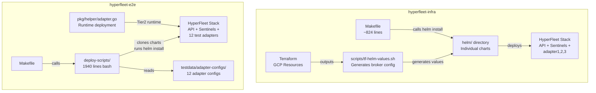

# Consolidate Component Installation Proposal - E2E and Infra

**Jira**: [HYPERFLEET-796](https://redhat.atlassian.net/browse/HYPERFLEET-796)

**Related**:
- [HYPERFLEET-1007 Spike](https://redhat.atlassian.net/browse/HYPERFLEET-1007) — Investigation findings

---

## Overview

This document proposes a design to consolidate duplicated component installation logic between `hyperfleet-infra` and `hyperfleet-e2e` repositories. Currently, both repositories maintain separate deployment codebases that deploy the same HyperFleet stack (API, Sentinel, Adapters).

**Goals**: 
- Eliminate the redundant deployment code to consistently deploy all components
- Parameterize adapter creation seamlessly without too much overhead of adding new configs
- Consistent installation of Helm charts for all components (remove wrapping around Helm charts)
- Allow for consistent implementation across different environments

## Current State


### Architecture Diagram



**hyperfleet-infra**:
- Makefile-based deployment (~824 lines)
- Individual Helm chart directories in `helm/` (adapter1, adapter2, adapter3, api, sentinel-clusters, sentinel-nodepools, maestro)
- Uses helm-git plugin to reference charts from component repositories
- Hardcoded adapter deployment (install-adapter1, install-adapter2, install-adapter3 targets)
- Terraform generates Pub/Sub values via `scripts/tf-helm-values.sh`

**hyperfleet-e2e**:
- Bash script-based deployment: `deploy-scripts/deploy-clm.sh` (1940 lines total)
- E2E-specific adapter configurations in `testdata/adapter-configs/` (12 adapter directories)
- Runtime adapter deployment in Go code (`pkg/helper/adapter.go`) used by Tier2 tests
- Different adapter set than infra: cl-namespace, cl-job, cl-deployment, cl-maestro, np-configmap, plus 7 negative-test adapters

### Problems with current state
1. **Code Duplication**: 1940 lines of bash scripts in hyperfleet-e2e duplicate deployment logic that hyperfleet-infra already provides
2. **Configuration Drift**: Changes in infra deployment that don't propagate to E2E cause false-positive test results
3. **Maintenance Burden**: Bugs like HYPERFLEET-903 (random suffix creating duplicate Helm releases) affect both repos
4. **Scaling Issues**: As adapter count grows, surface area for silent drift increases
5. **Different Deployment Methods**: E2E tests don't validate the actual production deployment process

## Proposal

### Adopt a Unified Helmfile
- Start using helmfile to deploy different components in whichever environment you decided
- Both repos use Makefile wrappers that call the shared Helmfile with environment-specific values
- E2E-specific adapter configs remain
- Infra-specific adapter configs remain
- Eliminate `deploy-scripts/` directory (1940 lines) from hyperfleet-e2e

### How Helmfile Solves the Inconsistency Problem

#### Single Release Definition, Multiple Environments

**Current Problem For Adapters**: hyperfleet-infra and hyperfleet-e2e have separate deployment code:
- **infra**: Makefile targets (install-adapter1, install-adapter2, install-adapter3)
- **e2e**: Bash scripts (deploy-clm.sh clones charts, runs helm install for adapters)
- **Result**: When we update deployment logic in infra, E2E doesn't get the change automatically

**Helmfile Solution**: ONE helmfile.yaml defines ALL releases:

```yaml
# potential example
environments:
  e2e:
    values:
    - environments/e2e/e2e-config.yaml.gotmpl # e2e specific implementation

{{ range .Values.adapters }}
  - name: {{ .name }}
    chart: hyperfleet-adapter/hyperfleet-adapter
    values:
      - values/base-adapter.yaml.gotmpl
    set:
      - name: adapterConfig.yaml
        file: {{ .configYamlPath }}
      - name: adapterTaskConfig.yaml
        file: {{ .taskYamlPath }}
      ....
{{ end }}
```

**Both repos use the SAME release logic**, just with different adapter lists:
- **infra**: `adapter-configs.yaml` → adapter1, adapter2, adapter3
- **e2e**: `adapter-configs.yaml` → cl-namespace, cl-job, cl-deployment, np-configmap, etc.


**Example - Adding a New Adapter**:

*Current state (requires changes in 2 places):*
```bash
# In hyperfleet-infra/Makefile - add new target
# Add new chart to the helm/
install-adapter4:
    helm upgrade --install adapter4 ...

# In hyperfleet-e2e/deploy-scripts/adapter.sh - add new case
case "$adapter_name" in
    adapter4) deploy_adapter4 ;;
esac
```

*With Helmfile (config-driven, no code changes):*
```yaml
# In hyperfleet-infra/configs/adapters/adapters.yaml
adapters:
  - name: adapter1
    resourceType: clusters
    configYamlPath: configs/adapters/adapter1/config.yaml
    taskYamlPath: configs/adapters/adapter1/task-config.yaml
    ...
  - name: adapter4  # <- Add this line with its config paths
    resourceType: clusters
    configYamlPath: configs/adapters/adapter4/config.yaml
    taskYamlPath: configs/adapters/adapter4/task-config.yaml
    ...
```

**Key benefit**: The helmfile repo contains ZERO adapter-specific configs. Each repo owns its configs and passes them via Makefile:
```makefile
make install-all ADAPTER_CONFIGS_DIR=configs/adapters
```

Both infra and E2E use the SAME deployment logic (`{{ range .Values.adapters }}`) with their OWN adapter lists.

#### Declarative Consistency Guarantees

**Current Problem**: Imperative bash scripts can produce different results:
- Race conditions in script execution
- Order-dependent operations (must install API before Sentinel before Adapters)
- Hard to verify "current state matches desired state"
- Manual rollback procedures that might be inconsistent

**Helmfile Solution**: Declarative desired state with built-in consistency checks
```yaml
helmDefaults:
  wait: true              # Always wait for resources to be ready
  cleanupOnFail: true     # Consistent rollback behavior
  timeout: 300            # Same timeout everywhere
  createNamespace: true   # Consistent namespace handling
```

**Impact**:
- ✅ `helmfile diff` shows drift between desired and actual state (bash has no equivalent)
- ✅ Idempotent: running twice produces same result (bash scripts may not be)
- ✅ Dependency management: Helmfile handles release ordering automatically
- ✅ Parallel deployments: Helmfile can deploy independent releases concurrently

**Concrete Example - Deployment Consistency Check**:

*Current state (no drift detection):*
```bash
# Did the deployment work? Check manually
kubectl get pods -n hyperfleet
# Are we at the desired state? Hope so...
```

*With Helmfile (automatic verification):*
```bash
$ helmfile diff
# Shows EXACTLY what would change

$ helmfile sync
# Deploys differences

$ helmfile apply
# Deploys everything

$ helmfile diff
# No diff = current state matches desired state ✅
```

#### Environment-Specific Flexibility Without Code Duplication

**Current Problem**: Supporting multiple environments requires duplicating deployment code
- Local (RabbitMQ) vs GCP (Pub/Sub) → different broker config
- Different adapter sets → different installation logic
- Different namespaces → different kubectl contexts

**Helmfile Solution**: ONE codebase, environment-specific values
```yaml
environments:
  e2e:
    values:
    - environments/e2e/e2e-config.yaml.gotmpl # e2e specific implementation
  gcp: # gcp - dev clusters
    values:
    - environments/gcp/gcp-config.yaml.gotmpl
  local: # kind
    values:
      - environments/gcp/gcp-config.yaml.gotmpl

```

**Impact**:
- ✅ Add new environment: create new values file, no code changes
- ✅ Environment differences are DATA, not CODE
- ✅ All environments use same tested deployment logic
- ✅ Easy to compare environments: `diff environments/gcp/base.yaml environments/e2e/base.yaml`

**Summary: Why Helmfile is the Right Approach**

| Problem | Current State | Helmfile Solution |
|---------|---------------|-------------------|
| **Code Duplication** | 1940 lines bash + 824 lines Makefile = 2764 lines | ~300 lines YAML (89% reduction) |
| **Configuration Drift** | E2E and infra can drift silently | Physically impossible when sharing same file |
| **Maintenance Burden** | Fix bugs in 2 places (infra + E2E) | Fix once, propagates everywhere |
| **Scaling (adding adapters)** | Modify Makefile + bash scripts in both repos | Add one line to adapter-configs.yaml |
| **Different Deployment Methods** | E2E doesn't validate production deployment | E2E uses SAME helmfile as production |
| **Drift Detection** | None - manual inspection required | `helmfile diff` shows exactly what changed |
| **Rollback** | Manual, error-prone | `helmfile rollback` - consistent procedure |
| **Idempotency** | Not guaranteed (bash is imperative) | Guaranteed (declarative desired state) |

<!-- Design -->
#### Architecture Design

Three architectural approaches are considered for organizing the Helmfile configuration:

##### Option A: Helmfile in Separate Repository (Recommended)

```mermaid
graph TB
    subgraph "architecture repo"
        ARCH_HF[helmfile/<br/>Canonical config]
    end
    
    subgraph "hyperfleet-infra"
        INF_MK[Makefile]
        INF_CLONE[Clone/reference<br/>helmfile repo]
        
        INF_MK -->|fetch| INF_CLONE
        INF_CLONE -->|uses| ARCH_HF
        ARCH_HF -->|helmfile sync --environment gcp| PROD[Infra Stack<br/>adapter1,2,3]
    end
    
    subgraph "hyperfleet-e2e"
        E2E_MK[Makefile]
        E2E_CLONE[Clone/reference<br/>helmfile repo]
        E2E_CFG[testdata/adapter-configs/<br/>12 E2E configs]
        
        E2E_MK -->|fetch| E2E_CLONE
        E2E_CLONE -->|uses| ARCH_HF
        ARCH_HF -->|references| E2E_CFG
        ARCH_HF -->|helmfile sync --environment e2e| E2E[E2E Stack<br/>12 adapters]
    end
    
    style ARCH_HF fill:#483A58
    style E2E_CFG fill:#63A088
```



**Benefits**:
- ✅ True single source of truth - helmfile lives in one canonical location
- ✅ Version controlled deployment patterns in architecture repo
- ✅ Easy to audit - all deployment changes visible in architecture repo
- ✅ Multiple repos can consume the same helmfile
- ✅ Enforces consistency - impossible for repos to drift

**Drawbacks**:
- ⚠️ Adds dependency on architecture repo availability
- ⚠️ CI must clone additional repo (can be cached)
- ⚠️ Breaking changes affect multiple repos simultaneously
- ⚠️ Slower iteration for deployment changes (must PR to architecture repo)

##### Option B: Helmfile in hyperfleet-infra, Referenced by E2E

```mermaid
graph TB
    subgraph "hyperfleet-infra"
        INF_MK[Makefile<br/>Thin wrapper]
        INF_HF[helmfile/<br/>Canonical config]
        
        INF_MK -->|helmfile sync --environment gcp| INF_HF
        INF_HF -->|deploys| PROD[Infra Stack<br/>adapter1,2,3]
    end
    
    subgraph "hyperfleet-e2e"
        E2E_MK[Makefile<br/>Thin wrapper]
        E2E_CFG[testdata/adapter-configs/<br/>12 E2E configs]
        
        E2E_MK -->|calls ../hyperfleet-infra/Makefile<br/>--environment e2e| INF_MK
        INF_HF -->|references| E2E_CFG
        INF_HF -->|deploys| E2E[E2E Stack<br/>12 adapters]
    end
    
    style INF_HF fill:#483A58
    style E2E_CFG fill:#63A088
```



**Benefits**:
- ✅ Single source of truth in hyperfleet-infra
- ✅ Faster iteration - changes in infra repo only
- ✅ Simpler CI setup - E2E just references sibling directory
- ✅ Natural ownership - infra team owns deployment configuration

**Drawbacks**:
- ⚠️ Assumes hyperfleet-infra and hyperfleet-e2e are cloned side-by-side
- ⚠️ Less portable - can't easily share with other repos
- ⚠️ Coordination required between infra and E2E teams for changes

##### Option C: Duplicate Helmfile in Both Repos (Not Recommended)

```mermaid
graph TB
    subgraph "hyperfleet-infra"
        INF_MK[Makefile]
        INF_HF[helmfile/<br/>Local copy]
        
        INF_MK -->|helmfile sync --environment gcp| INF_HF
        INF_HF -->|deploys| PROD[Infra Stack<br/>adapter1,2,3]
    end
    
    subgraph "hyperfleet-e2e"
        E2E_MK[Makefile]
        E2E_HF[helmfile/<br/>Local copy]
        E2E_CFG[testdata/adapter-configs/<br/>12 E2E configs]
        
        E2E_MK -->|helmfile sync --environment e2e| E2E_HF
        E2E_HF -->|references| E2E_CFG
        E2E_HF -->|deploys| E2E[E2E Stack<br/>12 adapters]
    end
    
    style INF_HF fill:#483A58
    style E2E_HF fill:#483A58
    style E2E_CFG fill:#63A088
```



**Benefits**:
- ✅ Complete independence - no cross-repo dependencies
- ✅ Fast iteration - each repo can change independently
- ✅ Simple CI setup - everything self-contained

**Drawbacks**:
- ❌ **Defeats the purpose** - still have duplication (helmfile instead of bash)
- ❌ Configuration drift risk remains
- ❌ Must synchronize changes manually between repos
- ❌ E2E tests don't validate production deployment method

**Recommendation**: **Option A (Separate Repository)** provides the best long-term maintainability and enforces true single source of truth. Option B is acceptable if side-by-side repo cloning is standard practice.

#### Implementation

The helmfile repo contains **only deployment logic**, not configuration data. Each consuming repo (infra, e2e) passes its own configs via Makefile parameters.

**Helmfile configuration** (`helmfile-repo/helmfile/helmfile.yaml.gotmpl` or `hyperfleet-infra/helmfile/helmfile.yaml.gotmpl`):
```yaml
helmDefaults:
  createNamespace: true
  wait: true
  timeout: 300
  cleanupOnFail: true

environments:
  e2e:
    values:
    - environments/e2e/e2e-config.yaml.gotmpl
  ...
commonLabels:
  group: hyperfleet

---
{{ if eq .Environment.Name "e2e" }}
repositories:
  - name: hyperfleet-api
    url: git+https://github.com/{{ .Values.chartOrg }}/hyperfleet-api@charts?ref={{ .Values.charts.api.chartRef }}&sparse=0
  - name: hyperfleet-sentinel
    url: git+https://github.com/{{ .Values.chartOrg }}/hyperfleet-sentinel@charts?ref={{ .Values.charts.sentinel.chartRef }}&sparse=0
  - name: hyperfleet-adapter
    url: git+https://github.com/{{ .Values.chartOrg }}/hyperfleet-adapter@charts?ref={{ .Values.charts.adapter.chartRef }}&sparse=0
{{ end }}

releases:
  # HyperFleet API
  - name: hyperfleet-api
    namespace: {{ .Values.namespace }}
    chart: hyperfleet-api/hyperfleet-api 
    labels:
      component: api
    values:
      - values/base-api.yaml.gotmpl

{{ range .Values.sentinels }}
  - name: sentinel-{{ .name }}
    namespace: {{ $.Values.namespace }}
    chart: hyperfleet-sentinel/hyperfleet-sentinel
    labels:
      component: sentinel
    values:
      - ./values/base-sentinel.yaml.gotmpl
      {{- range .values }}
      - {{ toYaml . | nindent 8 }}
      {{- end }}

{{ end }}


{{ range .Values.adapters }}
  - name: {{ .name }}
    namespace: {{ $.Values.namespace }}
    chart: hyperfleet-adapter/hyperfleet-adapter
    labels:
      component: adapter
    values:
      - ./values/base-adapter.yaml.gotmpl
      {{- range .values }}
      - {{ toYaml . | nindent 8 }}
      {{- end }}
    set:
      - name: adapterConfig.yaml
        file: {{ .configYamlPath }}
      - name: adapterTaskConfig.yaml
        file: {{ .taskYamlPath }}
      ...
{{ end }}
```

**Base environment E2E config** (`helmfile/environments/e2e/e2e-config.yaml.gotmpl`):
```yaml
{{- $namespace := env "NAMESPACE" | default "mahill-e2e" -}}

{{- $adapterConfigs := readFile .Values.adapterConfigDir | fromYaml -}} <-- Here is where we include the adapter configs
{{- $sentinelConfigs := readFile .Values.sentinelConfigDir | fromYaml -}} <-- Here is where we include the sentinel configs

chartOrg: {{ env "CHART_ORG" | default "openshift-hyperfleet" }}
namespace: {{ $namespace }}
projectId: {{ env "PROJECT_ID" | default "hcm-hyperfleet" }}
brokerType: {{ env "BROKER_TYPE" | default "googlepubsub" }}

charts:
  api:
    chartRef: {{ env "API_CHART_REF" | default "main" }}
    chartName: {{ env "API_CHART" | default "hyperfleet-api" }}
  sentinel:
    chartRef: {{ env "SENTINEL_CHART_REF" | default "main" }}
    chartName: {{ env "SENTINEL_CHART" | default "hyperfleet-sentinel" }}
  adapter:
    chartRef: {{ env "ADAPTER_CHART_REF" | default "main" }}
    chartName: {{ env "ADAPTER_CHART" | default "hyperfleet-sentinel" }}

# Specify changes to adapterConfigs or sentinelConfigs
...

```

**Makefile in hyperfleet-infra** (passes infra-specific configs):
```makefile
# hyperfleet-infra/Makefile

HELMFILE_ENV ?= gcp
NAMESPACE ?= hyperfleet
ADAPTER_CONFIGS_DIR ?= $(PWD)/configs/adapters/
SENTINEL_CONFIGS_DIR ?= $(PWD)/configs/sentinels/

.PHONY: install-all
install-all: check-helmfile
	cd helmfile && helmfile --environment $(HELMFILE_ENV) \
		--state-values-set namespace=$(NAMESPACE) \
    --state-values-set adapterConfigDir=$(ADAPTER_CONFIGS_DIR)
		--state-values-set sentinelConfigDir=$(SENTINEL_CONFIGS_DIR) \
		sync
```

**Makefile in hyperfleet-e2e** (passes e2e-specific configs):
```makefile
# hyperfleet-e2e/Makefile

HELMFILE_ENV ?= e2e
NAMESPACE ?= hyperfleet-e2e
ADAPTER_CONFIGS_DIR ?= $(PWD)/testdata/adapter-configs
SENTINEL_CONFIGS_DIR ?= $(PWD)/testdata/sentinel-configs

.PHONY: install-all
install-all:
	cd ../hyperfleet-infra && $(MAKE) install-all \
		HELMFILE_ENV=$(HELMFILE_ENV) \
		NAMESPACE=$(NAMESPACE) \
		ADAPTER_CONFIGS_DIR=$(ADAPTER_CONFIGS_DIR) \
		SENTINEL_CONFIGS_DIR=$(SENTINEL_CONFIGS_DIR)
```

**Adapter config in hyperfleet-infra** (`configs/adapters/adapters.yaml`):
```yaml
adapters:
  - name: adapter1
    resourceType: clusters
    configYamlPath: configs/adapters/adapter1/config.yaml
    taskYamlPath: configs/adapters/adapter1/task-config.yaml
  - name: adapter2
    resourceType: clusters
    configYamlPath: configs/adapters/adapter2/config.yaml
    taskYamlPath: configs/adapters/adapter2/task-config.yaml
  - name: adapter3
    resourceType: nodepools
    configYamlPath: configs/adapters/adapter3/config.yaml
    taskYamlPath: configs/adapters/adapter3/task-config.yaml
```

**Adapter config in hyperfleet-e2e** (`testdata/adapter-configs/adapters.yaml`):
```yaml
adapters:
  - name: cl-namespace
    resourceType: clusters
    configYamlPath: testdata/adapter-configs/cl-namespace/config.yaml
    taskYamlPath: testdata/adapter-configs/cl-namespace/task-config.yaml
  - name: cl-job
    resourceType: clusters
    configYamlPath: testdata/adapter-configs/cl-job/config.yaml
    taskYamlPath: testdata/adapter-configs/cl-job/task-config.yaml
  # ... 10 more E2E adapters
```

**Repository Structure**:

```
(In helmfile repo or hyperfleet-infra repo)
└── helmfile/
    ├── helmfile.yaml.gotmpl        # Deployment logic only
    ├── environments/
    │   ├── e2e-config.yaml.gotmpl
    │   ├── gcp-config.yaml.gotmpl
    │   └── local-config.yaml.gotmpl
    └── values/
        ├── base-api.yaml.gotmpl
        ├── base-sentinel.yaml.gotmpl
        └── base-adapter.yaml.gotmpl

hyperfleet-infra/
├── Makefile                        # Passes infra configs
└── configs/
    ├── adapters/
    │   ├── adapters.yaml          # Infra adapter list
    │   ├── adapter1/
    │   │   ├── adapter-config.yaml
    │   │   └── task-config.yaml
    │   ├── adapter2/
    │   └── adapter3/
    └── sentinels/
        ├── sentinels.yaml
        ├── clusters/
        └── nodepools/

hyperfleet-e2e/
├── Makefile                        # Passes e2e configs
└── testdata/
    ├── adapter-configs/
    │   ├── adapters.yaml          # E2E adapter list
    │   ├── cl-namespace/
    │   │   ├── config.yaml
    │   │   └── task-config.yaml
    │   ├── cl-job/
    │   └── ... (10 more)
    └── sentinel-configs/
        └── sentinels.yaml
```

#### Config Separation: Helmfile Repo Owns Logic, Consuming Repos Own Data

**Key Design Principle**: The helmfile repository contains **zero adapter or sentinel configs**. It only contains:
- Deployment logic (how to deploy)
- Base environment templates
- Helm value templates

Each consuming repo (hyperfleet-infra, hyperfleet-e2e) owns its own configs and passes them via Makefile parameters.

**Benefits of this approach**:

1. **Helmfile repo is truly portable**
   - Can be used by any repo without modification
   - No repo-specific paths hardcoded
   - Easy to add new consuming repos (hyperfleet-staging, hyperfleet-perf, etc.)

2. **Each repo controls its own configs**
   - hyperfleet-infra owns production adapter configs
   - hyperfleet-e2e owns test adapter configs
   - No need to PR to helmfile repo to add test adapters

3. **Clear separation of concerns**
   - **Helmfile repo**: HOW to deploy (logic)
   - **Consuming repos**: WHAT to deploy (data/configs)
   - Changes to deployment logic require helmfile PR
   - Changes to adapter configs only touch owning repo

4. **Flexible config locations**
   - Infra can keep configs in `configs/adapters/`
   - E2E can keep configs in `testdata/adapter-configs/`
   - Each repo chooses its own structure

**Example workflows**:

```bash
# hyperfleet-infra (production deployment)
make install-all \
    HELMFILE_ENV=gcp \
    ADAPTER_CONFIGS_DIR=configs/adapters \
    SENTINEL_CONFIGS_DIR=configs/sentinels

# hyperfleet-e2e (test deployment)
make install-all \
    HELMFILE_ENV=e2e \
    ADAPTER_CONFIGS_DIR=testdata/adapter-configs \
    SENTINEL_CONFIGS_DIR=testdata/sentinel-configs

# Future: hyperfleet-staging (staging deployment)
make install-all \
    HELMFILE_ENV=staging \
    ADAPTER_CONFIGS_DIR=staging-configs/adapters \
    SENTINEL_CONFIGS_DIR=staging-configs/sentinels
```

#### Environment Flexibility
- Support for different environments: Local installation, GKE installation, E2E workflows
- Sentinel and Adapter flexibility: can add new adapters to adapters.yaml easily without having to modify the charts or helmfile code
- Config portability: each repo owns its configs, helmfile repo stays clean

#### What We Gain

- **Single source of truth for logic**: One canonical helmfile for deployment logic (eliminates 1940 lines of bash)
- **Clear separation**: Helmfile repo owns HOW to deploy (logic), consuming repos own WHAT to deploy (configs)
- **Portable helmfile**: Zero hardcoded paths or repo-specific configs in helmfile - can be used by any repo
- **Reduced drift risk**: Deployment logic changes automatically propagate to all consuming repos
- **Each repo owns its configs**: No need to PR to helmfile repo to add test adapters or sentinels
- **Declarative deployment**: Helmfile provides idempotency, drift detection (`helmfile diff`), rollback
- **GitOps ready**: Declarative YAML enables ArgoCD, Flux integration
- **Better testing**: E2E validates actual production deployment method (same helmfile)
- **Simpler codebase**: ~300 lines of YAML vs 1940 lines of bash (84% reduction)
- **Built-in features**: Dependency ordering, parallel deployments, templating, environment management
- **Scalable**: Easy to add new consuming repos (staging, perf, etc.) without modifying helmfile

#### What We Lose / What Gets Harder

- **Coordination overhead**: Breaking changes require coordination between repos
- **CI setup**: Must install helmfile binary (30-60 seconds)
- **Debugging abstraction**: Templating errors less obvious than bash errors
- **Less imperative control**: Complex conditional logic harder in declarative Helmfile

#### Acceptable Because

- **Coordination is one-time**: Initial consolidation requires coordination, ongoing changes simpler
- **CI overhead negligible**: 30-60 sec install insignificant vs 10-15 min test runtime
- **Debugging tooling exists**: `helmfile --debug`, `helmfile template`, `helmfile diff` provide visibility
- **Complex logic rare**: Deployment workflows are straightforward; declarative suits this pattern
- **Industry trend**: Helmfile widely adopted; aligns with Kubernetes ecosystem standards
- **Easy addition of new adapters**: Adapters get added in the environments/e2e/adapters

#### Open Questions
- **Helmfile Location**: Team preference for Option A (separate architecture repo) vs Option B (hyperfleet-infra repo)?
- **Overrides**: Should we have the ability to override with env variables or should we keep it pretty bare?

## Alternatives Considered

### 1. Stick with Make and Bash
- Parameterized Makefile-only approach (original HYPERFLEET-1007 spike recommendation) is also viable for teams preferring no new tool dependencies.
- Update make targets in both infra and e2e
- Consolidate installation to infra and have e2e targets call infra repo
- Remove deploy scripts

#### Implementation
- Solely rely on different make targets for both e2e and infra
- Clone infra in e2e and install other components except for adapters using make commands
- Remove hyperfleet-infras dependency on wrapping charts


```makefile
# hyperfleet-infra/Makefile

ADAPTERS ?= adapter1:clusters adapter2:clusters adapter3:nodepools
ADAPTER_CONFIG_DIR ?= $(PWD)/helm

.PHONY: install-adapters
install-adapters:
	@for adapter_spec in $(ADAPTERS); do \
		adapter_name=$${adapter_spec%%:*}; \
		resource_type=$${adapter_spec##*:}; \
		$(MAKE) _install-adapter-instance \
			ADAPTER_NAME=$$adapter_name \
			RESOURCE_TYPE=$$resource_type; \
	done

.PHONY: _install-adapter-instance
_install-adapter-instance:
	helm upgrade --install $(ADAPTER_NAME) \
		hyperfleet-adapter/hyperfleet-adapter \
		--namespace $(NAMESPACE) \
		--set-file adapterConfig.yaml=$(ADAPTER_CONFIG_DIR)/$(ADAPTER_NAME)/config.yaml \
		--set-file adapterTaskConfig.yaml=$(ADAPTER_CONFIG_DIR)/$(ADAPTER_NAME)/task-config.yaml
```

**E2E usage**:
```bash
cd ../hyperfleet-infra
make install-all \
    ADAPTERS="cl-namespace:clusters cl-job:clusters np-configmap:nodepools" \
    ADAPTER_CONFIG_DIR=../hyperfleet-e2e/testdata/adapter-configs
```

#### What We Gain

- **No new tools**: Team already knows Make and Helm
- **Aligns with spike**: Exactly what HYPERFLEET-1007 proposed
- **Simple dependencies**: Just make + helm + helm-git
- **Easy debugging**: Standard shell commands, visible output
- **Flexible control flow**: Can add complex logic (conditionals, retries, health checks)

#### What We Lose / What Gets Harder

- **Maintainability**: Can still run into the same issues we see now because there could be drift between the make file targets
- **Limited templating**: Can't leverage Go templates for dynamic values. Not the best approach for parameterizing adapter installations.
- **Make syntax arcane**: Complex escaping, limited string manipulation
- **Still needs bash**: Health checks, pub/sub management too complex for pure Make
- **Not declarative**: Lacks idempotency, drift detection
- **~400+ lines Makefile**: More complex than Helmfile
- **Duplicated Makefile**: Unless E2E symlinks/submodules infra Makefile


## Appendix: Helmfile Resources

**Documentation**:
- [Helmfile Official Docs](https://helmfile.readthedocs.io/)
- [Helmfile Best Practices](https://helmfile.readthedocs.io/en/latest/writing-helmfile/)
- [Environment Values](https://helmfile.readthedocs.io/en/latest/writing-helmfile/#environment-values)
